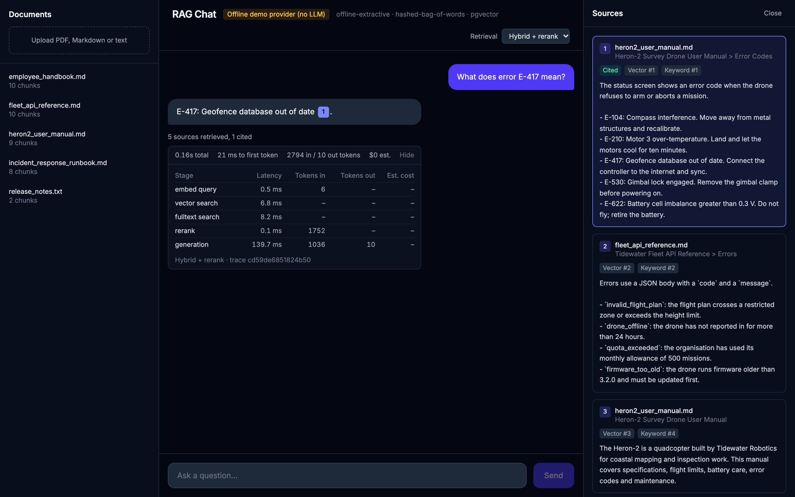
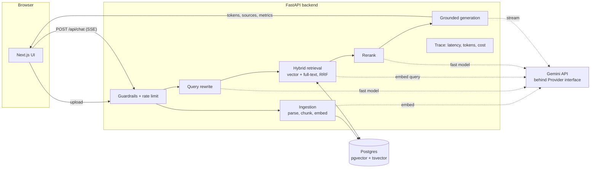

# Streaming RAG Chat

Chat with your documents. Upload PDF, Markdown or text files, ask questions, and get
streamed answers that cite the exact passages they are based on.

The core pipeline is written by hand (no LangChain or similar) so that every step is
short enough to read and explain: about 1,500 lines of Python for ingestion, hybrid
retrieval, reranking, grounded generation, guardrails and tracing.



*Screenshot taken with the offline demo provider (see [results/](results/README.md)).*

## Features

- **Ingestion**: structure-aware chunking with overlap, batched embeddings, and idempotent
  re-ingestion (an unchanged file is skipped; an edited file re-embeds only changed chunks).
- **Hybrid retrieval**: pgvector similarity + Postgres full-text search, merged with
  Reciprocal Rank Fusion, then an LLM rerank over the top candidates.
- **Grounded generation**: numbered citations are required, and the model must reply
  "I don't know" when the sources are insufficient. Streamed over Server-Sent Events.
- **Conversation**: follow-up questions are rewritten into standalone queries before retrieval.
- **Guardrails**: input length limits, retrieved text is delimited, escaped and flagged for
  injection phrases, per-IP rate limiting.
- **Observability**: a trace id per request and one structured log line with per-stage
  latency, tokens and estimated cost. The same numbers are shown under each answer.
- **Evaluation**: a golden dataset and a script comparing vector, hybrid and hybrid + rerank.

## Architecture



More detail: [docs/ARCHITECTURE.md](docs/ARCHITECTURE.md) (request flow, data model) and
[docs/DECISIONS.md](docs/DECISIONS.md) (ADR-style decisions).

## Quick start

Requires Docker.

```bash
cp .env.example .env        # then set GEMINI_API_KEY
docker compose up --build
```

Open http://localhost:3000, upload a few files from `sample_docs/`, and ask a question.
The API is at http://localhost:8000 (interactive docs at `/docs`).

**No API key?** Run the offline demo provider. It needs no key and is clearly labelled in
the UI. It is not a language model (answers are sentences copied from the sources), but it
exercises every part of the pipeline:

```bash
PROVIDER=local docker compose up --build
```

### Local development

```bash
docker compose up -d db

cd backend
python3.12 -m venv .venv && source .venv/bin/activate
pip install -e ".[dev]"
uvicorn app.main:app --reload          # http://localhost:8000

cd frontend
npm install
npm run dev                            # http://localhost:3000
```

Checks:

```bash
cd backend
ruff check . ../evals && mypy app tests ../evals
pytest                                  # unit tests, LLM mocked
RUN_INTEGRATION=1 PROVIDER=local pytest # + integration tests against Postgres

cd frontend
npm run lint && npx tsc --noEmit && npm run build
```

## Evaluation results

**Not measured yet.** The eval script needs a Gemini API key, and none was available when
this was built, so [evals/RESULTS.md](evals/RESULTS.md) holds an empty table rather than
made-up numbers. To produce them:

```bash
docker compose up -d db
python evals/run_evals.py
```

What it measures, over 31 questions in [evals/golden.jsonl](evals/golden.jsonl):

| Metric | Meaning |
|---|---|
| Hit rate@5 | Share of answerable questions whose evidence passage is in the top 5 chunks. |
| MRR@5 | Mean of 1/rank of that passage. |
| Faithfulness (1-5) | LLM judge: is every claim in the answer supported by the retrieved sources? |
| Relevance (1-5) | LLM judge: does the answer address the question and agree with the reference? |
| Abstention rate | Share of unanswerable questions answered with "I don't know". |
| Latency, cost | Mean per question, per configuration. |

for three configurations: **vector only**, **hybrid (RRF)**, **hybrid + rerank**.

The golden set mixes three kinds of question on purpose: exact identifiers such as
`E-417` (where keyword search should win), paraphrases that share few words with the
source (where embeddings should win), and questions the documents cannot answer. The
sample documents are original and fictional, so a model cannot answer from memory.

## Design decisions and trade-offs

Short versions; the reasoning is in [docs/DECISIONS.md](docs/DECISIONS.md).

**Why hybrid search.** Embeddings match meaning but are weak on exact tokens: error codes,
part numbers, API field names. Keyword search is the opposite. Real questions contain both,
so both retrievers run and their results are fused. RRF is used for fusion because it works
on ranks, which avoids having to normalise cosine similarity against `ts_rank` scores that
live on different scales.

**Why this chunk size.** Chunks target about 400 tokens with 60 tokens (15%) of overlap and
never cross a heading. Smaller chunks retrieve precisely but lose context; larger ones dilute
the embedding with several topics and cost more prompt tokens. Around 400 tokens holds one
complete idea in typical documentation, and five of them fit a prompt for about 2,000 tokens.
This is a starting point: the eval script exists so that the value can be tuned on data.

**Why pgvector over a dedicated vector database.** One database holds the documents, the
vectors and the full-text index. That gives transactional ingestion (a re-ingested document
is swapped atomically), hybrid search in plain SQL, and one service to run and back up. HNSW
in pgvector is fast enough well into millions of vectors. A dedicated vector database earns
its place at larger scale or when you need features like built-in sharding.

**Cost and latency choices.**
- A cheaper "fast" model handles query rewriting and reranking; the stronger model is used
  only for the final answer.
- The rewrite call is skipped on the first turn, and generation is skipped when nothing is
  retrieved.
- Embeddings are reused across re-ingestion through chunk content hashes.
- Only 5 chunks reach the prompt, and rerank passages are truncated to 700 characters.
- Sources are sent before the first token, and time to first token is measured separately
  from total time, because that is what the user perceives.
- Reranking adds a full LLM round trip before the first token. The UI lets you switch it
  off per question, and the evals report what it buys.

**Known limitations.**
- **The Gemini provider has not been run against the live API.** It was written against
  the SDK and current docs and type-checks, but there was no key to test with. Expect to
  adjust details (model names in `.env`, embedding request shape) on first run.
- Eval numbers are not measured yet, for the same reason.
- The rate limiter is in memory, so it is per process. Multiple replicas need a shared store.
- No authentication or per-user document isolation: every user sees every document.
- PDFs are parsed as plain text per page. Tables, multi-column layouts and scanned pages
  (no OCR) will chunk poorly, and PDF chunks have a page number but no section.
- Token counts for chunking and for embedding cost are estimated at 4 characters per token.
- Injection handling is basic: delimiting plus a phrase tripwire. It reduces risk; it does
  not make hostile documents safe.
- The LLM judge is the same model family as the generator, which can flatter its own answers.
- The golden set is small (31 questions over 5 short documents). Differences of a few
  points between configurations are within noise.

## Repository layout

```
backend/app/
  ingestion/    parsers.py, chunking.py, pipeline.py
  retrieval/    search.py (SQL), fusion.py (RRF), rerank.py, pipeline.py
  generation/   prompt.py, rewrite.py, stream.py (SSE)
  providers/    base.py (interface), gemini.py, local.py (offline demo)
  guardrails.py, observability.py, config.py, db.py, schema.sql
backend/tests/  unit tests (LLM mocked) + Postgres integration tests
frontend/src/   Next.js UI: components/, hooks/useChat.ts, lib/sse.ts
evals/          golden.jsonl, run_evals.py, metrics.py, RESULTS.md
sample_docs/    original CC0 documents used by the evals
results/        screenshots of the running app
docs/           ARCHITECTURE.md, DECISIONS.md
```
