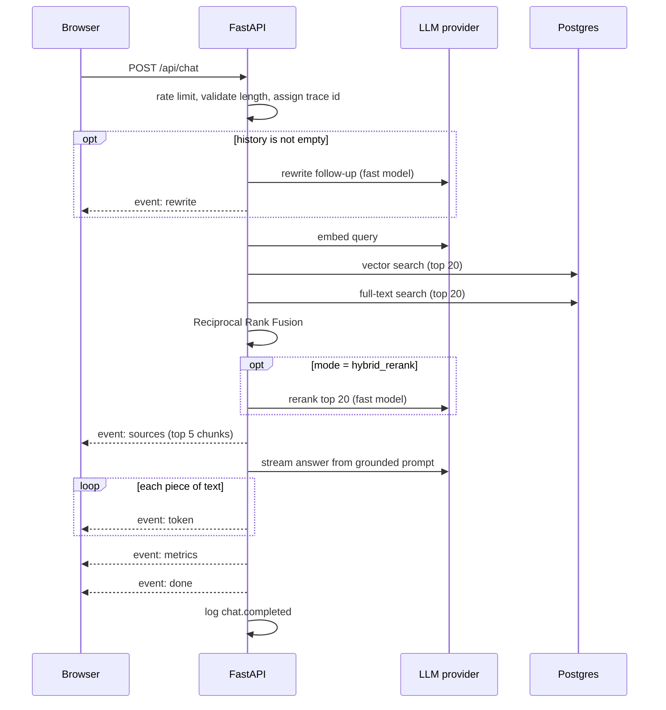
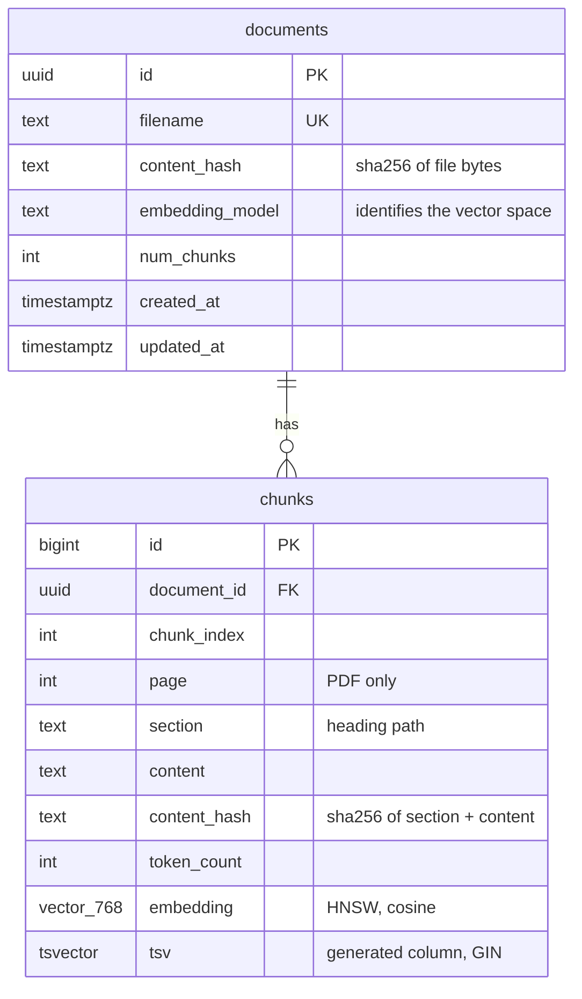

# Architecture

Three services, started together by `docker compose up`:

| Service | Tech | Responsibility |
|---|---|---|
| `frontend` | Next.js 16, React 19, TypeScript, Tailwind | Chat UI, upload, citations, metrics |
| `backend` | Python 3.12, FastAPI, psycopg 3 | Ingestion, retrieval, generation, guardrails |
| `db` | Postgres 16 + pgvector | Documents, chunks, vector index, full-text index |

The browser talks to the backend directly (CORS), not through a Next.js proxy, so nothing
sits between the SSE stream and the user that could buffer it.

## Chat request flow

`POST /api/chat` with `{question, history, mode}` returns a `text/event-stream`.



Step by step, with the file that does it:

1. **Guardrails** (`guardrails.py`, `routes/chat.py`). The rate limiter runs as a FastAPI
   dependency, before any work. Pydantic validates the body; the question length is checked
   against `max_question_chars`. Middleware in `main.py` assigns the trace id and returns
   it in `X-Trace-Id`.
2. **Rewrite** (`generation/rewrite.py`). If there is history, the fast model turns
   "and how long to charge it?" into a standalone question. Skipped on the first turn. An
   empty or oversized reply falls back to the original question.
3. **Retrieve** (`retrieval/pipeline.py`). The query is embedded once. `search.py` runs two
   SQL queries: cosine distance over the HNSW index, and an OR-ed `tsquery` over the GIN
   index ranked with `ts_rank_cd`. `fusion.py` merges the two id lists with RRF.
4. **Rerank** (`retrieval/rerank.py`). In `hybrid_rerank` mode the fast model reads the top
   20 fused candidates and returns their numbers in relevance order. Unparseable reply:
   keep the fused order.
5. **Flag** (`generation/stream.py`). Each chunk is checked against injection phrases; hits
   are logged and marked in the UI.
6. **Generate** (`generation/prompt.py`, `stream.py`). The top 5 chunks are wrapped in
   numbered `<source>` blocks, followed by the question. The system prompt requires
   citations, forbids outside knowledge, defines the exact "I don't know" sentence, and
   says sources are untrusted data. Text is streamed as `token` events.
7. **Metrics**. The `Trace` (`observability.py`) has timed each stage and summed tokens and
   cost. It is sent as the `metrics` event and written as one JSON log line, including when
   the client disconnects mid-stream.

### SSE events

| Event | Data | When |
|---|---|---|
| `rewrite` | `{query}` | Only if the question was rewritten |
| `sources` | `{sources: [...]}` | After retrieval, before any token |
| `token` | `{text}` | Repeated |
| `metrics` | totals, per-stage numbers, `first_token_ms`, `cited` | After the last token |
| `done` | `{}` | End of a successful stream |
| `error` | `{message}` | Instead of the rest, on failure; no internal details |

The frontend reads the stream with `fetch` because `EventSource` cannot send a POST body.
`lib/sse.ts` buffers text until a blank line, since a network read can end mid-event.
`hooks/useChat.ts` collects tokens in a variable and updates React state at most every
50 ms, so a fast stream does not cause hundreds of renders.

## Ingestion flow

`POST /api/documents` (multipart upload):

1. Hash the file bytes. Same filename, same hash, same embedding model: return `unchanged`.
2. **Parse** (`ingestion/parsers.py`) into blocks: a paragraph plus its heading path
   (Markdown) or page number (PDF).
3. **Chunk** (`ingestion/chunking.py`): pack paragraphs up to the target size without
   crossing a section; split oversized paragraphs at sentence ends; carry a tail of each
   chunk into the next as overlap.
4. **Embed** only chunks whose content hash is not already stored for this document, in
   batches of 32. The section title is prepended to the embedded text.
5. **Store** in one transaction: upsert the document row, delete its old chunks, insert the
   new ones. Readers see the old version or the new one, never a mix.

## Data model



- `tsv` is a generated column, so the full-text index can never drift from `content`.
- `embedding_model` is stored per document. Vectors from different models are not
  comparable, so a model change forces a re-embed instead of silently mixing spaces.
- Deleting a document cascades to its chunks.

## Provider interface

`providers/base.py` defines the only surface the pipeline uses:

```python
class Provider(Protocol):
    name: str
    embedding_id: str
    async def embed(self, texts, *, for_query=False) -> Embeddings
    async def generate(self, system, prompt, *, fast=False) -> Completion
    def stream(self, system, prompt) -> AsyncIterator[StreamChunk]
```

`gemini.py` implements it with the official `google-genai` SDK. `local.py` implements it
with no network calls for demos and integration tests. Adding another model is one new
class and one line in `providers/__init__.py`.

## Observability

Every log line is JSON. One request produces, for example:

```json
{"event": "chat.completed", "outcome": "ok", "mode": "hybrid_rerank", "trace_id": "cd59de6851824b50",
 "total_ms": 160.2, "input_tokens": 2794, "output_tokens": 10, "cost_usd": 0.0,
 "stages": {"embed_query": {"ms": 0.5}, "vector_search": {"ms": 6.8}, "fulltext_search": {"ms": 8.2},
            "rerank": {"ms": 0.1}, "generation": {"ms": 139.7}}}
```

The trace id is in the response header, the `metrics` event, every log line for the request,
and any error message shown to the user, so a user report can be matched to its logs.
